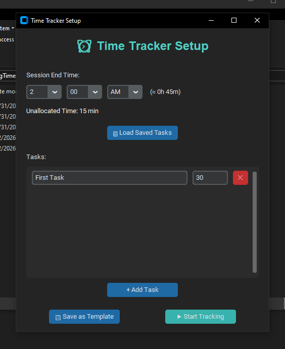
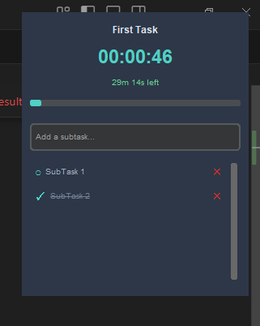
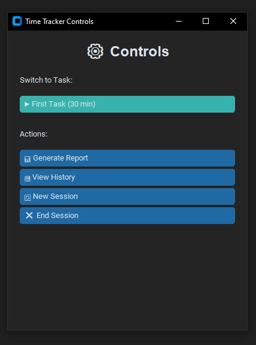
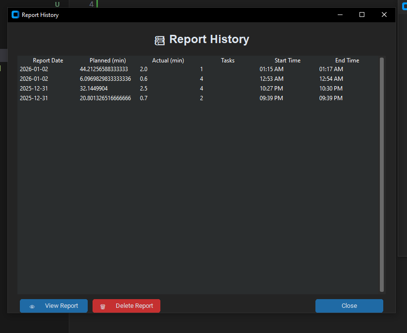
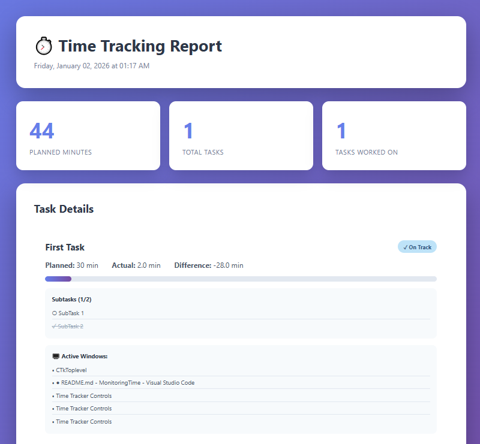

# MonitoringTime

A simple yet powerful time tracking application for Windows to help you stay focused and manage your work sessions effectively. It runs in the background with a floating timer widget and can be accessed from the system tray.

##  Features

-   **Session & Task Management**: Create and manage your daily tasks with time estimates for each.
-   **Floating Timer**: A sleek, "always on top" widget to keep you aware of the current task and time.
-   **System Tray Integration**: Easily access all features from a convenient system tray icon.
-   **Flexible Controls**: Pause, resume, and switch between tasks at any time.
-   **Subtask Tracking**: Break down complex tasks into smaller, manageable subtasks directly from the floating widget.
-   **Usage Insights**: Tracks the active window titles during tasks to give you a better understanding of where your time goes.
-   **HTML Reports**: Generate detailed, visually appealing HTML reports at the end of each session.
-   **History Viewer**: Review your past session reports anytime.
-   **Task Templates**: Save your common task lists as templates for quick session setups.
-   **Modern UI**: A clean, modern, and dark-themed user interface.

## 🚀 Getting Started

Follow these instructions to get the application up and running on your local machine.

### Prerequisites

-   Python 3.7+
-   pip (Python package installer)

### Installation

1.  **Clone the repository** (or download and extract the source code):
    ```sh
    git clone https://github.com/your-username/MonitoringTime.git
    cd MonitoringTime
    ```

2.  **Install the required packages** using pip:
    ```bash
    pip install psutil pygetwindow pystray pillow customtkinter
    ```

### Running the Application

To start the application, run the following command from the project's root directory:

```bash
python time_tracker.py
```

On the first launch, a setup window will appear, allowing you to define your tasks and session duration. After setup, the application will run in the background. You can interact with it via the icon in your system tray.

##  Screenshots

*The application features a modern, dark-themed UI for a comfortable user experience.*

### Start Session:


### Counter Widget:


### Settings:


### View History Report:



## 📜 License

This project is licensed under the **MIT License**. See the [LICENSE](LICENSE) file for more details.
